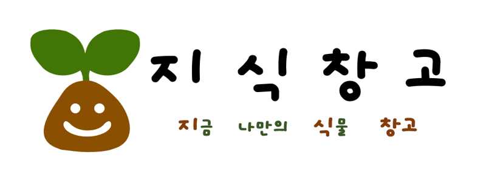

# 지식(지금 나만의 식물)창고 (팀명 : 지식창고)
SNS

## 서비스 소개
* 서비스명:  지식창고
* 서비스설명: 반려식물을 테마로 한 SNS 서비스
 

## 📅 프로젝트 기간
2023.05.11 ~ 2023.05.25 (2주)
 

## ⛏ 기술스택

## ⭐ 주요 기능
* 1 : 1 실시간 채팅
* 캘린더를 활용한 식물 다이어리
* 좋아요, 북마크
* 댓글
 

## ⚙ 시스템 아키텍처

## 📌 서비스 흐름도

## 📌 ER다이어그램

## 🖥 화면 구성

### 로그인/회원가입/메인페이지

### 글쓰기

### 게시글 상세

### 마이페이지, 저장한 게시글

### 식물 상세

### 실시간 채팅

## 👨‍👩‍👦‍👦 팀원 역할

## 🤾‍♂️ 트러블슈팅
  
* 문제1 
 실시간 채팅을 구현하기 위해 기존 채팅 목록을 불러오는 데 어려움이 존재. 이를 해결하기 위해 웹소켓을 처리하는 자바 코드에서 채팅 내역을 DB에 담고, 채팅방을 클라이언트가 요청할 때 jsp가 DB의 채팅내역을 불러와 미리 띄워주는 방법을 선택하여 해결하였음.
 

